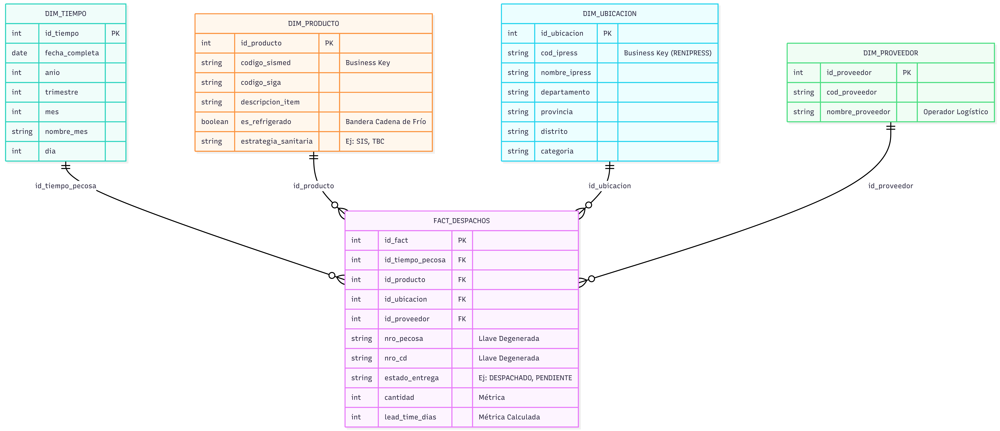

# CENARES Logistics Analytics

**Data Warehouse, ETL Pipeline & Modelo Predictivo de Riesgo Logístico**

[](https://www.python.org/)
[](https://www.postgresql.org/)
[](https://www.hitachivantara.com/en-us/products/pentaho-platform.html)
[](https://powerbi.microsoft.com/)
[](https://scikit-learn.org/)

Plataforma de Business Intelligence e ingeniería de datos que audita, monitorea y predice el riesgo operativo en la distribución nacional de suministros médicos estratégicos gestionada por el **Centro Nacional de Abastecimiento de Recursos Estratégicos en Salud (CENARES)**, entidad del Ministerio de Salud del Perú.

El sistema integra un Data Warehouse dimensional (metodología Kimball), pipelines ETL automatizados, un modelo de Machine Learning que clasifica el riesgo de incumplimiento de entrega, y un dashboard ejecutivo en Power BI para la toma de decisiones logísticas.

---

## Contexto y problema

CENARES distribuye insumos médicos críticos a establecimientos de salud a nivel nacional. El seguimiento manual de entregas dificulta detectar a tiempo retrasos o incumplimientos de SLA, especialmente cuando los datos provienen de fuentes heterogéneas (CD1, PECOSA, RENIPRESS) con formatos y calidad inconsistentes.

Este proyecto centraliza esa información en un modelo dimensional confiable y añade una capa predictiva que **clasifica anticipadamente el riesgo de cada entrega** (Alto / Medio / Bajo), permitiendo priorizar el seguimiento operativo antes de que ocurra el incumplimiento.

---

## Arquitectura

```
Fuentes Heterogéneas (CD1 · PECOSA · RENIPRESS · CSV)
                    │
                    ▼
    ┌───────────────────────────┐
    │   DATA LAKE (Raw)         │  Limpieza y normalización (Python / Regex / QA)
    └───────────────────────────┘
                    │
                    ▼
    ┌───────────────────────────┐
    │  STAGING (PostgreSQL)     │  Ingesta y validaciones (Pentaho PDI)
    └───────────────────────────┘
                    │
                    ▼
    ┌───────────────────────────┐
    │  DATA MART (Star Schema)  │  ◄── Inferencia ML (Random Forest + Encoding)
    └───────────────────────────┘
                    │
                    ▼
    ┌───────────────────────────┐
    │  Power BI · KPIs de SLA   │
    └───────────────────────────┘
```

### Componentes clave

| Capa | Descripción |
|---|---|
| **Staging** | Ingesta desacoplada sin restricciones de integridad, para carga masiva rápida (`stg_cenares`, `stg_renipress`) |
| **Data Mart** | Esquema estrella (Kimball) con tabla de hechos `fact_distribucion` y dimensiones `dim_tiempo` (role-playing), `dim_ubicacion`, `dim_producto`, `dim_estrategia`, `dim_almacen` |
| **Capa predictiva** | Modelo entrenado (`modelo_riesgo_cenares_final.pkl`) que clasifica la probabilidad de retraso o incumplimiento e inyecta el resultado en la columna `riesgo_sal` |
| **Dashboard** | Tablero ejecutivo en Power BI con medidas DAX para cumplimiento de SLA y distribución de niveles de riesgo |

---

## Modelo dimensional



El modelo centraliza las operaciones logísticas y habilita análisis cruzado por geolocalización, producto, estrategia de distribución y línea de tiempo.

---

## Decisiones técnicas destacadas

- **Business key resiliente**: se rediseñó la tabla de hechos usando `nro_solicitud` como llave de negocio (en vez de `nro_pecosa`), aplicando el patrón *Kimball Default Member* (`'PENDIENTE'`) para no perder registros cuando falta el número de PECOSA.
- **Reconciliación de fuentes**: se resolvió un desajuste de Inner Join entre los archivos CD1 2024 y PECOSA 2023 mediante un script de auditoría de discrepancias dedicado.
- **Compatibilidad SQLAlchemy 2.x**: se corrigieron errores de ejecución envolviendo las queries crudas con `text()`, requerido a partir de SQLAlchemy 2.x.
- **Enriquecimiento de dimensiones**: `dim_ubicacion` se enriqueció con un proceso híbrido de normalización geográfica para mejorar la calidad del análisis por zona.

---

## Estructura del repositorio

```
cenares-logistics-bi-dw/
├── dashboard/
│   ├── CENARES_Logistica_Analytics.pbix   # Tablero interactivo en Power BI
│   └── CENARES_Dashboard_Report.pdf       # Reporte exportado en alta resolución
├── data/
│   ├── raw/                               # Datasets crudos (ignorado por Git)
│   ├── processed/                         # Datasets procesados y normalizados
│   └── historic/                          # Reportes de auditoría y discrepancias
├── docs/
│   ├── BI_MODELO_ESTRELLA.png             # Diagrama de arquitectura estrella
│   └── Documentos_Proyecto.zip            # Informes, diccionarios y actas del proyecto
├── etl/
│   ├── pentaho/                           # Jobs (.kjb) y transformaciones (.ktr)
│   └── python/                            # Scripts de normalización, QA y predicción
├── models/
│   ├── modelo_riesgo_cenares_final.pkl    # Pipeline entrenado de Machine Learning
│   └── diccionarios_encoding_cenares.pkl  # Codificadores categóricos
├── sql/
│   ├── 01_create_staging_area.sql         # DDL de la capa Staging
│   └── 02_create_datamart_star.sql        # DDL del Data Mart dimensional
├── .env.example                           # Plantilla de variables de entorno
└── .gitignore
```

---

## Requisitos previos

- Python 3.10+
- PostgreSQL 14+
- Pentaho Data Integration (PDI / Kettle) 9.x+
- Power BI Desktop

---

## Instalación y ejecución

**1. Clonar el repositorio y configurar variables de entorno**
```bash
git clone https://github.com/TU_USUARIO/cenares-logistics-bi-dw.git
cd cenares-logistics-bi-dw
cp .env.example .env
# Edita .env con tus credenciales de PostgreSQL
```

**2. Desplegar la base de datos**
```bash
psql -U postgres -d cenares_dw -f sql/01_create_staging_area.sql
psql -U postgres -d cenares_dw -f sql/02_create_datamart_star.sql
```

**3. Ejecutar los pipelines ETL y de Machine Learning**
```bash
python etl/python/orquestador_limpieza_v2.py
python etl/python/auditoria_discrepancias.py
python etl/python/enriquecer_dim_ubicacion_hibrido.py
python etl/python/orquestador_predictivo.py
```

---

## Stack

`Python` · `pandas` · `scikit-learn` · `SQLAlchemy` · `PostgreSQL` · `Pentaho Data Integration` · `Power BI` · `DAX`

---

## Próximos pasos

- [ ] Orquestación de los pipelines con Airflow o cron
- [ ] Tests automatizados para las validaciones de staging
- [ ] Reentrenamiento periódico del modelo de riesgo con nuevos datos

---

## Autor

Proyecto académico desarrollado como trabajo final del curso de Business Intelligence.

**Mario Huarcaya** — [LinkedIn](#) · [GitHub](#)